CUDA Path Tracer
================

**University of Pennsylvania, CIS 5650: GPU Programming and Architecture, Project 3 - CUDA Path Tracer**

* Catherine Cheng
  * [LinkedIn](https://www.linkedin.com/in/catherine-wanning-cheng/), [personal website](https://www.catherine-wanning-cheng.com/projects-1)
* Tested on: Windows 11, AMD Ryzen 7 5800H @ 3.20GHz 16GB, NVIDIA GeForce RTX 3070
## Introduction
### Some Final Renders
- | 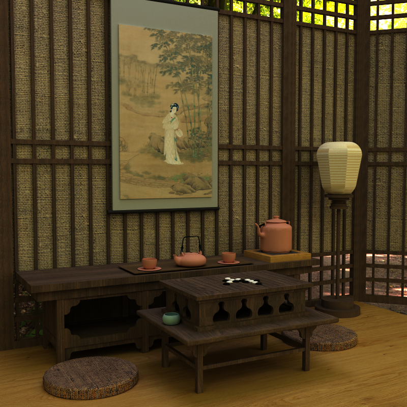 |
  |:-----------------------------:|
  | A render of a tea room        |

| 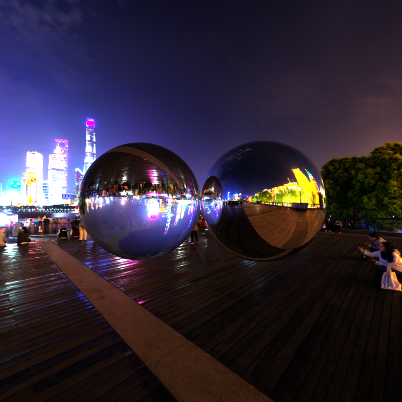 |  |
|:-----------------------------:|:-----------------------------:|
| Refraction (left) and Reflection (right)           | Diffuse material with environment mapping           |

This project is a Path Tracer written in C++ and uses CUDA for GPU support. The specific features of this path tracer are as written below:
- **Materials**
  - Diffuse
  - Mirror - Perfect specular material
  - Glass - Transmissive material with refraction
  - Emissive
- **Visuals**
  - Environment mapping
  - Intel® Open Image Denoise integration
  - Mesh Loading with tinyOBJ
  - Texture & Normal mapping
  - Stocastic Anti-Aliasing
- **Performance**
  - Stream Compaction - filter out the rays that are already terminated
  - Material Sort - sort paths and intersections based on material to avoid divergence

## Feature Breakdowns
### Scene Construction
The scenes are loaded by a .JSON file located in ``/scenes`` directory. To launch the path tracer with a specific scene, add the relative path of the scene to the command argument, e. g. ``../scenes/cornell.json``

The scene .JSON file contains several sections: ``Materials``, ``Camera``, ``Environment``, and ``Objects``, where the material section defines a list of materials to be used in the scene, the camera section defines the location, lookat direction, FOV, path trace depth, render resolution, and iteration count of the scene, tne environment section defines the skybox or background color of the scene, and the object section defines the shapes to be rendered. The specific structure of the scene files can be viewed in `scenes/` folder. Currently, the path tracer supports `Diffuse`, `Specular`, `Transmissive`, and `Emitting` types of materials. 
### Mesh & Texture Loading
Custom mesh loading is supported in this path tracer. Specifically, .OBJ files can be loaded in the scene supported by tinyOBJ. To load a custom .OBJ mesh, change the `TYPE` value under the `Objects` section in the scene file to `"custom"`, add the name of the mesh to the `PATH` variable, and place the mesh under the `/scenes/Mesh` folder. 

Custom textures can also be read from the .MTL file. After making sure the texture names align with what is listed in .MTL file, place the textures in `/scenes/Mesh/Textures` folder. Currently, the path tracer supports diffuse and normal maps.
- |  |
  |:-----------------------------:|
  | Custom Mesh Loading        |

### Environment Loading
If wanting to load a skybox .HDR file or a specific background color, simply add to the `Environment` section of the scene file by filling in the `FILENAME` variable. If not loading a environment map, the background color can be changed by adjusting the `COLOR` variable. If no `Environmet` section defined, the default background color will be black.

- |  |
  |:-----------------------------:|
  | Environment Mapping        |

### Materials
In this path tracer, surfaces interact with light through BSDF (Bidirectional Scattering Distribution Function) materials. BSDF materials describe how light is scattered—either reflected or transmitted—when it hits a surface. The supported BSDF materials in this path tracer include:

- **Diffuse**: Represents perfect diffuse reflection, where light scatters uniformly in all directions, creating a soft, matte appearance.
- **Specular**: Models perfect mirror-like reflection, where light reflects at the same angle it hits the surface, resulting in sharp reflections.

| 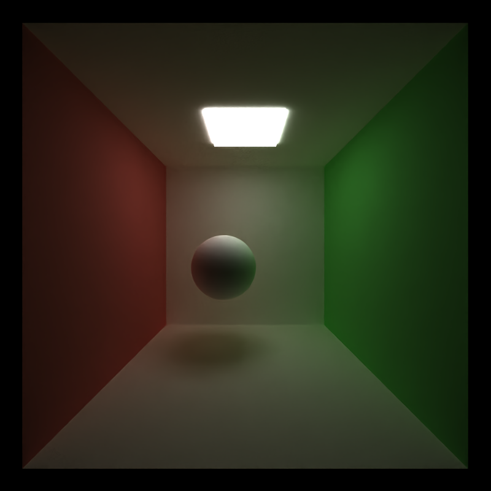 | 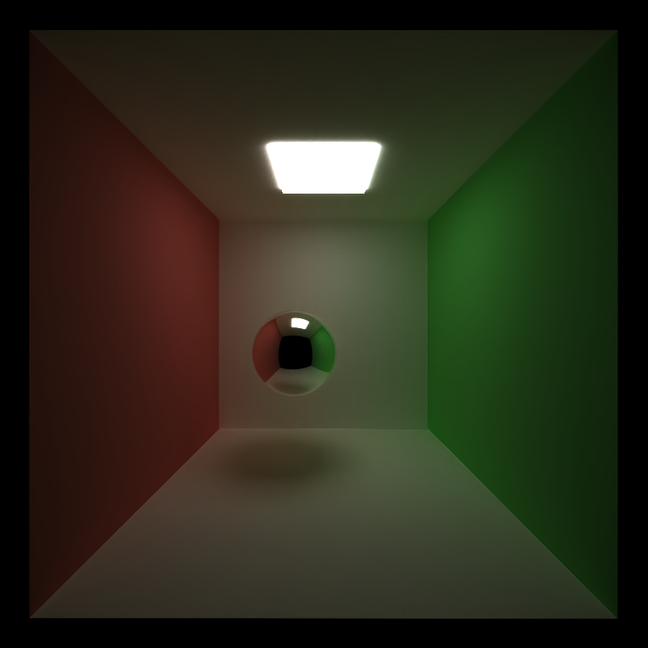 |
|:-----------------------------:|:-----------------------------:|
| Diffuse           | Mirror           |

- **Transmissive**: Allows light to pass through the material to simulate glass-like surfaces with refraction and transparency.
- **Emissive**: Emits light directly from the surface, and serves as a light source within the scene.

| 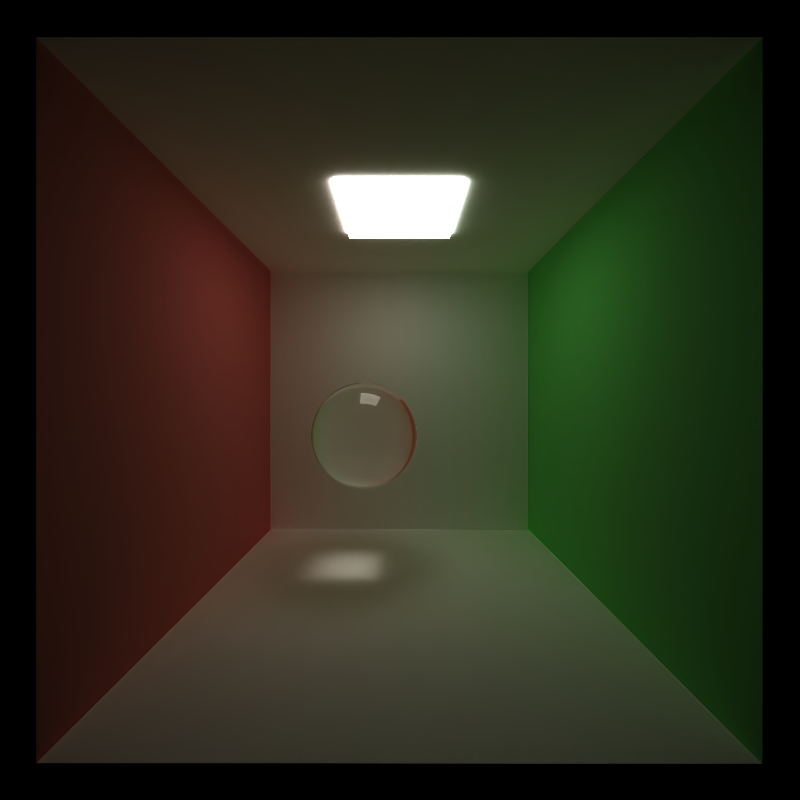 | 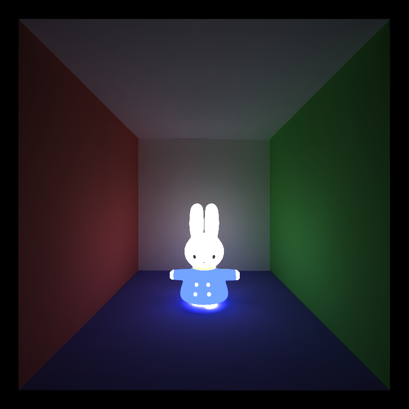 |
|:-----------------------------:|:-----------------------------:|
| Transmissive           | Emissive           |

These BSDF materials provide a foundation for rendering realistic interactions between light and surfaces in various environments, making it possible to simulate different material types and lighting effects.

### Denoise
To enhance the visual quality of rendered images, this path tracer incorporates [Intel Open Image Denoise (OIDN)](https://github.com/RenderKit/oidn), a powerful AI-based denoiser. OIDN reduces noise in path-traced images by utilizing deep learning to predict and remove noise patterns, resulting in cleaner, more polished final images. This process significantly improves rendering efficiency, especially when using lower sample counts, allowing for faster image convergence without compromising detail and clarity.

| 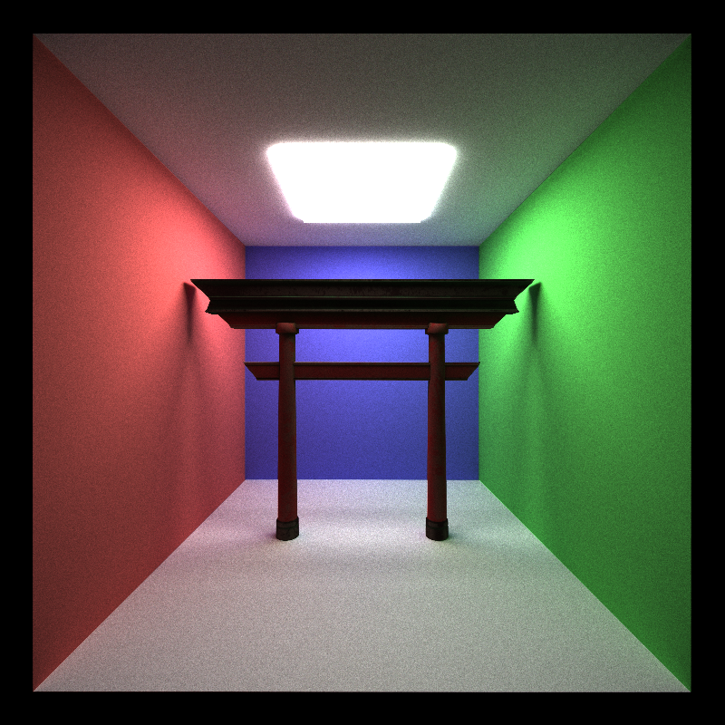 |  |
|:-----------------------------:|:-----------------------------:|
| >Before Denoising           | After Denoising           |

While using the [raw "beauty" buffer](https://github.com/RenderKit/oidn#open-image-denoise-overview) to denoise the final image, the albedo and normal maps are also passed into the auxilary buffers to enhance the results.

|  | 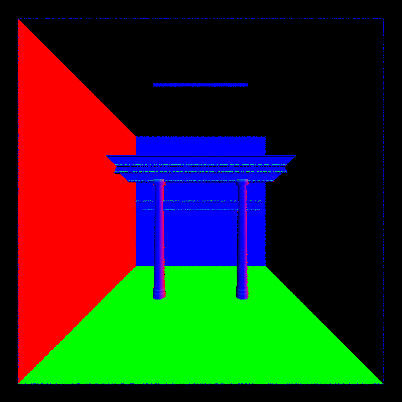 |
|:-----------------------------:|:-----------------------------:|
| Albedo           | Normal           |

However, while denoising could significant improve the look of the rendered images, it causes extra runtime to perform the denoising and causes render FPS to drop. 

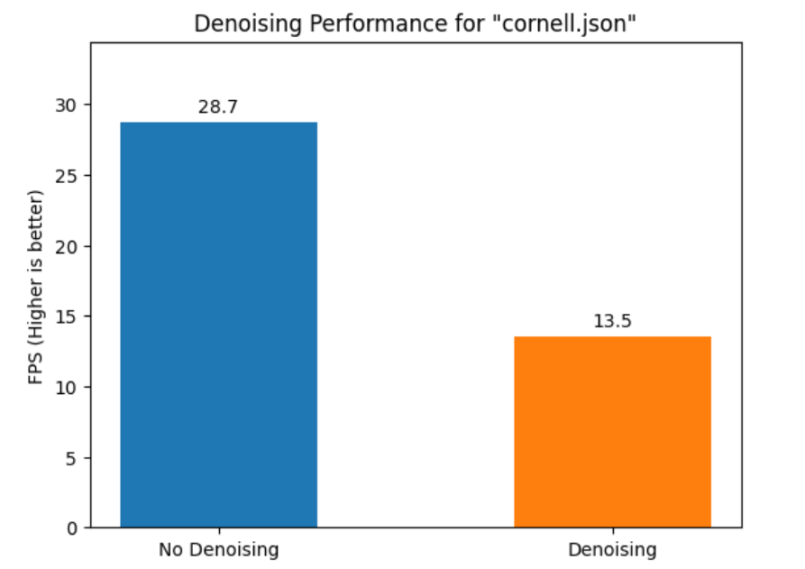

### Anti-Aliasing
Stochastic anti-aliasing is also utilized to smooth out jagged edges in the rendered image. By randomly jittering the ray direction within each pixel and averaging the results through Monte Carlo sampling, the path tracer achieves a natural anti-aliasing effect. This approach allows for improved image quality without additional computational cost, as anti-aliasing is inherently integrated into the path tracing process. For below images, it is obvious that the one before anti-aliasing has jagged edges.

| 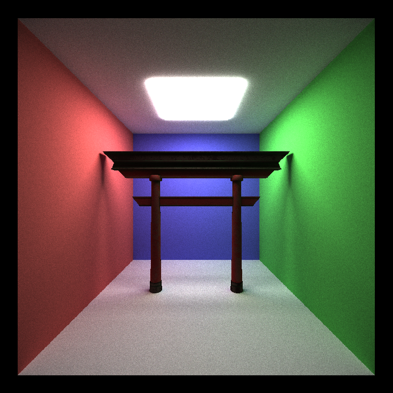 |  |
|:-----------------------------:|:-----------------------------:|
| Before Anti-Aliasing           | After Anti-Aliasing           |

## Performance Analysis
### Stream Compaction
In the logic of the path tracer, when a ray hits an object with emissive material or nothing or reaches a depth count, it would be terminated. In this way, as some rays are terminated while the others are still working, there are a lot of spare threads costing extra runtime. Thus, stream compaction is performed at each iteration to reduce such lost. Below is a chart comparing whether stream compaction is performed:

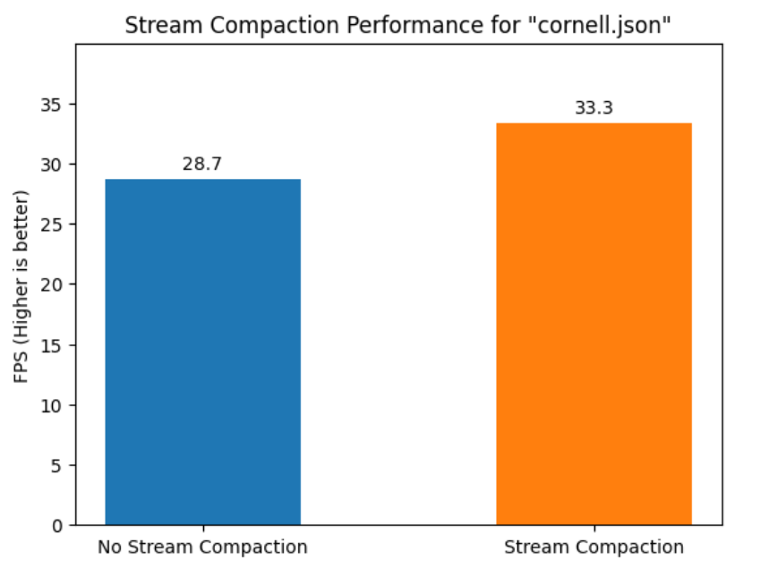

### Material Sort
After the rays hit the object for the first time, they are then scattered to different directions and hit object with different materials. As this divergence would drag the performance when the scene contains large number of materials, we sort the path segments and intersections each iteration based on their material. The chart below shows the comparison between whether material sorting is performed. Specifically, the "simple scene" uses "cornell.json", which simply uses virtual geometries and the "heavy scene" uses the [tea room scene](#Some-Final-Renders) (87681 triangles).

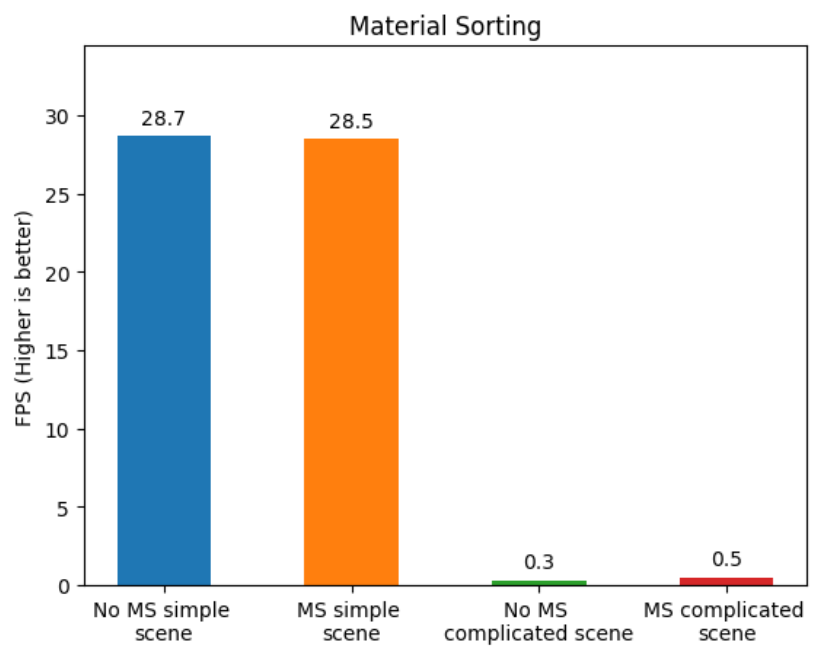